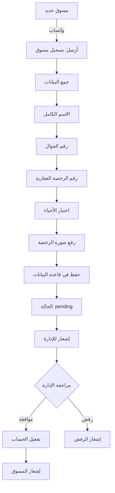

# 🏠 منظومة عقاري جدة - التحليل والتطوير
## Real Estate Jeddah System - Analysis & Development Plan

---

## 📊 تحليل الوضع الحالي

### ✅ ما تم إنجازه:
| المكون | الحالة | الوصف |
|--------|--------|-------|
| Backend API | ✅ يعمل | Node.js/Express على Vercel |
| قاعدة البيانات | ✅ يعمل | Supabase PostgreSQL |
| بوت واتساب | ✅ يعمل | Wasender API متصل |
| رسائل البوت | ✅ جاهز | قوائم احترافية عربية |
| مواصفات ديناميكية | ✅ جاهز | حسب نوع العقار |

### ⚠️ يحتاج تطوير:
| المكون | الحالة | المطلوب |
|--------|--------|---------|
| تسجيل المسوقين | ❌ غير موجود | نظام تسجيل + موافقة |
| لوحة التحكم | ❌ أساسية فقط | لوحة كاملة |
| الأمان | ⚠️ جزئي | JWT + RLS + تشفير |
| أحياء جدة | ❌ غير موجود | قائمة محددة |

---

## 🎯 المتطلبات الجديدة

### 1️⃣ تخصيص مدينة جدة فقط

```
📍 أحياء جدة المقترحة (30 حي):

🏢 الأحياء الراقية:
━━━━━━━━━━━━━━━━━━
1. الحمراء
2. الروضة
3. الشاطئ
4. الأندلس
5. المحمدية
6. الزهراء
7. النعيم
8. الفيصلية
9. السلامة
10. الربوة

🏘️ أحياء وسط جدة:
━━━━━━━━━━━━━━━━━━
11. البلد
12. العزيزية
13. النسيم
14. الصفا
15. المروة
16. الجامعة
17. السليمانية
18. الخالدية
19. بني مالك
20. الكندرة

🏗️ أحياء شمال جدة:
━━━━━━━━━━━━━━━━━━
21. أبحر الشمالية
22. أبحر الجنوبية
23. الياقوت
24. المرجان
25. اللؤلؤ
26. ذهبان

🏠 أحياء جنوب جدة:
━━━━━━━━━━━━━━━━━━
27. السنابل
28. الحرازات
29. المنتزهات
30. أخرى (تحديد)
```

---

### 2️⃣ نظام تسجيل المسوقين



#### بيانات المسوق المطلوبة:
```json
{
    "full_name": "محمد أحمد العمري",
    "phone": "0501234567",
    "license_number": "1234567890",
    "license_image": "https://...",
    "city": "جدة",
    "districts": ["الحمراء", "الروضة", "الشاطئ"],
    "status": "pending",
    "registration_date": "2026-01-28",
    "activated_at": null,
    "activated_by": null
}
```

---

### 3️⃣ لوحة التحكم الإدارية

```
┌─────────────────────────────────────────────────────────────┐
│                    🏠 لوحة تحكم عقاري جدة                     │
├─────────────────────────────────────────────────────────────┤
│  📊 الإحصائيات                                               │
│  ┌──────────┐ ┌──────────┐ ┌──────────┐ ┌──────────┐       │
│  │ 150      │ │ 45       │ │ 12       │ │ 89       │       │
│  │ عقارات  │ │ مسوقين  │ │ شركات   │ │ طلبات   │       │
│  └──────────┘ └──────────┘ └──────────┘ └──────────┘       │
├─────────────────────────────────────────────────────────────┤
│  🔔 الموافقات المعلقة                                        │
│  ├── 5 مسوقين جدد بانتظار الموافقة                          │
│  ├── 3 شركات تطوير بانتظار التحقق                           │
│  └── 12 عقار بانتظار المراجعة                               │
├─────────────────────────────────────────────────────────────┤
│  📱 آخر المحادثات                                           │
│  ├── 0501234567 - يبحث عن فيلا في الحمراء                   │
│  ├── 0559876543 - يريد تأجير شقة في الشاطئ                  │
│  └── 0541112222 - استفسار عن التمويل                        │
└─────────────────────────────────────────────────────────────┘
```

#### صفحات لوحة التحكم:
| الصفحة | الوظيفة |
|--------|---------|
| 🏠 الرئيسية | إحصائيات + تنبيهات |
| 👥 المسوقين | قائمة + موافقات + بحث |
| 🏢 شركات التطوير | قائمة + موافقات + عقاراتهم |
| 🏘️ العقارات | كل العقارات + فلترة + موافقات |
| 💬 المحادثات | سجل كامل + بحث |
| 👤 العملاء | قائمة + طلباتهم |
| 📊 التقارير | إحصائيات + تصدير |
| ⚙️ الإعدادات | أحياء + رسائل + صلاحيات |

---

## 🔐 التحليل الأمني

### المخاطر والحلول:

| المخاطر | الخطورة | الحل |
|---------|---------|------|
| دخول غير مصرح | 🔴 عالي | JWT + 2FA |
| تسريب بيانات | 🔴 عالي | RLS + تشفير |
| هجمات SQL Injection | 🔴 عالي | Prepared Statements (Supabase) |
| هجمات XSS | 🟡 متوسط | Input Sanitization |
| Spam واتساب | 🟡 متوسط | Rate Limiting |
| انتحال هوية | 🟡 متوسط | التحقق من الرخصة |

### 🛡️ الإجراءات الأمنية المقترحة:

```javascript
// 1. JWT Authentication
const token = jwt.sign({ userId, role }, SECRET, { expiresIn: '24h' });

// 2. Rate Limiting
const limiter = rateLimit({
    windowMs: 15 * 60 * 1000, // 15 دقيقة
    max: 100 // 100 طلب كحد أقصى
});

// 3. Input Validation
const validatePhone = (phone) => /^05\d{8}$/.test(phone);
const validateLicense = (license) => /^\d{10}$/.test(license);

// 4. Password Hashing (للإدارة)
const hashedPassword = await bcrypt.hash(password, 12);

// 5. CORS Configuration
app.use(cors({
    origin: ['https://real-whats.vercel.app'],
    credentials: true
}));
```

### Row Level Security (RLS) في Supabase:
```sql
-- المسوق يرى عقاراته فقط
CREATE POLICY "Marketer sees own properties"
ON properties FOR SELECT
USING (marketer_id = auth.uid());

-- المسوق يعدل عقاراته فقط
CREATE POLICY "Marketer updates own properties"
ON properties FOR UPDATE
USING (marketer_id = auth.uid());

-- الإدارة ترى كل شيء
CREATE POLICY "Admin full access"
ON properties FOR ALL
USING (
    EXISTS (
        SELECT 1 FROM admin_users 
        WHERE id = auth.uid() 
        AND role IN ('super_admin', 'admin')
    )
);
```

---

## 📋 خطة التطوير المقترحة

### المرحلة 1: الأساسيات (أسبوع 1)
- [ ] تحديث قاعدة البيانات بأحياء جدة
- [ ] نظام تسجيل المسوقين عبر واتساب
- [ ] صفحة الموافقات في لوحة التحكم
- [ ] JWT Authentication للإدارة

### المرحلة 2: لوحة التحكم (أسبوع 2)
- [ ] تصميم لوحة تحكم احترافية
- [ ] صفحة المسوقين + الموافقات
- [ ] صفحة العقارات + المراجعة
- [ ] صفحة المحادثات

### المرحلة 3: التكامل (أسبوع 3)
- [ ] نظام شركات التطوير
- [ ] إشعارات فورية
- [ ] تقارير وإحصائيات
- [ ] تصدير البيانات

### المرحلة 4: الأمان والاختبار (أسبوع 4)
- [ ] اختبار شامل
- [ ] تدقيق أمني
- [ ] توثيق API
- [ ] إطلاق تجريبي

---

## 🗄️ تحديثات قاعدة البيانات المطلوبة

### جدول أحياء جدة:
```sql
CREATE TABLE jeddah_districts (
    id UUID PRIMARY KEY DEFAULT uuid_generate_v4(),
    name_ar VARCHAR(50) NOT NULL,
    name_en VARCHAR(50),
    zone VARCHAR(20), -- north, south, center, east, west
    is_active BOOLEAN DEFAULT TRUE,
    properties_count INT DEFAULT 0,
    created_at TIMESTAMP DEFAULT NOW()
);
```

### تحديث جدول المسوقين:
```sql
ALTER TABLE marketers ADD COLUMN IF NOT EXISTS license_number VARCHAR(20);
ALTER TABLE marketers ADD COLUMN IF NOT EXISTS license_image TEXT;
ALTER TABLE marketers ADD COLUMN IF NOT EXISTS districts JSONB DEFAULT '[]';
ALTER TABLE marketers ADD COLUMN IF NOT EXISTS status VARCHAR(20) DEFAULT 'pending';
ALTER TABLE marketers ADD COLUMN IF NOT EXISTS activated_at TIMESTAMP;
ALTER TABLE marketers ADD COLUMN IF NOT EXISTS activated_by UUID;
ALTER TABLE marketers ADD COLUMN IF NOT EXISTS rejection_reason TEXT;
```

### جدول سجل الموافقات:
```sql
CREATE TABLE approvals_log (
    id UUID PRIMARY KEY DEFAULT uuid_generate_v4(),
    entity_type VARCHAR(20) NOT NULL, -- marketer, developer, property
    entity_id UUID NOT NULL,
    action VARCHAR(20) NOT NULL, -- approved, rejected, pending
    admin_id UUID REFERENCES admin_users(id),
    reason TEXT,
    created_at TIMESTAMP DEFAULT NOW()
);
```

---

## 🔌 API Endpoints المطلوبة

### المسوقين:
```
POST   /api/marketers/register     # تسجيل مسوق جديد
GET    /api/marketers              # قائمة المسوقين (إدارة)
GET    /api/marketers/:id          # تفاصيل مسوق
PUT    /api/marketers/:id/approve  # موافقة على مسوق
PUT    /api/marketers/:id/reject   # رفض مسوق
GET    /api/marketers/:id/properties # عقارات المسوق
```

### شركات التطوير:
```
POST   /api/developers/register    # تسجيل شركة
GET    /api/developers             # قائمة الشركات
PUT    /api/developers/:id/approve # موافقة
PUT    /api/developers/:id/reject  # رفض
GET    /api/developers/:id/properties # عقارات الشركة
```

### العقارات:
```
GET    /api/properties             # قائمة العقارات
GET    /api/properties/pending     # عقارات بانتظار الموافقة
PUT    /api/properties/:id/approve # موافقة على عقار
PUT    /api/properties/:id/reject  # رفض عقار
```

### الإحصائيات:
```
GET    /api/stats/dashboard        # إحصائيات لوحة التحكم
GET    /api/stats/districts        # إحصائيات حسب الحي
GET    /api/stats/marketers        # إحصائيات المسوقين
```

---

## 💡 أفكار احترافية إضافية

### 1. نظام التحقق من الرخصة:
```javascript
// التحقق من صحة رقم الرخصة عبر API هيئة العقار
async function verifyLicense(licenseNumber) {
    // يمكن ربطه مع REGA API مستقبلاً
    const isValid = /^\d{10}$/.test(licenseNumber);
    return { valid: isValid, verified: false };
}
```

### 2. نظام النقاط والتقييم:
```sql
-- تقييم المسوقين
ALTER TABLE marketers ADD COLUMN points INT DEFAULT 0;
ALTER TABLE marketers ADD COLUMN level VARCHAR(20) DEFAULT 'bronze';
-- bronze < 100, silver < 500, gold < 1000, platinum >= 1000
```

### 3. إشعارات ذكية:
```javascript
// إشعار الإدارة عند تسجيل مسوق جديد
async function notifyAdminNewMarketer(marketer) {
    // 1. إشعار واتساب للإدارة
    // 2. بريد إلكتروني
    // 3. إشعار في لوحة التحكم
}
```

### 4. تقارير أسبوعية تلقائية:
```javascript
// Cron job كل يوم أحد
const weeklyReport = {
    newCustomers: 45,
    newProperties: 12,
    newMarketers: 3,
    topDistrict: "الحمراء",
    pendingApprovals: 8
};
```

---

## 🚀 أفكار إضافية قابلة للتنفيذ

### 1️⃣ تحسين تجربة العميل داخل واتساب

| الميزة | الوصف | الأولوية |
|--------|-------|----------|
| 🏘️ بحث بالأحياء | أول سؤال بعد نوع العقار يكون "اختر الحي" | 🔴 عالي |
| 🔍 فلاتر سريعة | عدد الغرف، المساحة، عمر العقار، موقف/مصعد | 🟡 متوسط |
| 📅 حجز معاينة | اختيار يوم/وقت + إرسال الموقع + تأكيد | 🟡 متوسط |
| ⭐ قائمة مفضلة | "احفظ هذا العقار" + "اعرض المفضلة" | 🟢 منخفض |
| 📊 متابعة الطلب | آخر حالة + المسوق المعيّن + العقارات المقترحة | 🔴 عالي |

---

### 2️⃣ ربط العملاء بالمسوقين بشكل أذكى

```javascript
// التوزيع الذكي للعملاء
const assignMarketer = async (customer) => {
    // 1. فلترة حسب الحي
    // 2. فلترة حسب نوع العقار
    // 3. فلترة حسب سعة المسوق (الأقل عملاء)
    // 4. SLA: إذا لم يرد خلال 10 دقائق → تحويل تلقائي
};
```

| الميزة | الوصف |
|--------|-------|
| 📍 توزيع حسب الحي | الحي → نوع العقار → سعة المسوق |
| ⏱️ SLA 10 دقائق | تحويل تلقائي إذا لم يرد المسوق |
| 📊 Lead Scoring | نقاط حسب جدية الطلب (ميزانية + حي + موعد) |
| 🚫 منع التضارب | عميل واحد = مسوق واحد (إلا بقرار إداري) |

---

### 3️⃣ منع الاحتيال والتحقق

```sql
-- جدول بصمات الإعلانات لكشف التكرار
CREATE TABLE property_fingerprints (
    id UUID PRIMARY KEY,
    property_id UUID REFERENCES properties(id),
    text_hash VARCHAR(64),      -- SHA256 للوصف
    image_hashes JSONB,         -- perceptual hash للصور
    created_at TIMESTAMP
);

-- سجل تدقيق كامل
CREATE TABLE audit_log (
    id UUID PRIMARY KEY,
    entity_type VARCHAR(20),
    entity_id UUID,
    action VARCHAR(50),
    actor_id UUID,
    actor_type VARCHAR(20),     -- admin, marketer, system
    details JSONB,
    ip_address INET,
    created_at TIMESTAMP
);
```

| الإجراء | الوصف |
|---------|-------|
| 🔐 KYC خفيف | تحقق رقم الجوال + توثيق هوية (اختياري) |
| 🔍 كشف التكرار | بصمة نصية + مقارنة صور (hash) |
| 🚨 حظر تلقائي | أسعار شاذة / وصف مكرر / صور قليلة |
| 📋 Audit Log | كل تعديل/موافقة/رفض مع من ومتى |

---

### 4️⃣ تحسين قاعدة البيانات والبحث

```sql
-- تفعيل PostGIS للبحث الجغرافي
CREATE EXTENSION IF NOT EXISTS postgis;

-- إضافة عمود الموقع
ALTER TABLE properties ADD COLUMN location_point GEOGRAPHY(POINT);

-- البحث "بالقرب من" نقطة معينة
SELECT * FROM properties
WHERE ST_DWithin(
    location_point,
    ST_MakePoint(39.1925, 21.4858)::geography,
    5000  -- 5 كم
);

-- Indexes قوية للأداء
CREATE INDEX idx_props_district_type_price 
ON properties(district, property_type, price, status);
```

| التحسين | الفائدة |
|---------|---------|
| 📍 PostGIS | بحث "بالقرب من" نقطة/معلم |
| 🗺️ Polygons للأحياء | تقارير دقيقة + خرائط حرارية |
| ⚡ Indexes | سرعة البحث × 10 |
| 💾 Cache (Redis) | تقليل الضغط + سرعة |

---

### 5️⃣ لوحة التحكم: ميزات متقدمة

```
┌─────────────────────────────────────────────────────────┐
│ 📬 Inbox المحادثات                                      │
├─────────────────────────────────────────────────────────┤
│ [جديد] [مفتوح] [بانتظار مسوق] [مغلق]                    │
│                                                         │
│ 📞 0501234567 - فيلا في الحمراء         🔴 جديد        │
│ 📞 0559876543 - شقة في الشاطئ          🟡 مفتوح       │
│ 📞 0541112222 - استفسار تمويل          🟢 مغلق        │
└─────────────────────────────────────────────────────────┘

┌─────────────────────────────────────────────────────────┐
│ 📊 Kanban الطلبات                                       │
├─────────┬─────────┬─────────┬─────────┬─────────┬──────┤
│  New    │Qualified│ Viewing │ Negot.  │  Won    │ Lost │
│  (12)   │   (8)   │   (5)   │   (3)   │  (45)   │ (10) │
├─────────┼─────────┼─────────┼─────────┼─────────┼──────┤
│ ██████  │ █████   │ ████    │ ███     │ ██████  │ ███  │
└─────────┴─────────┴─────────┴─────────┴─────────┴──────┘
```

| الميزة | الوصف |
|--------|-------|
| 📬 Inbox موحد | تصفية + ملاحظات داخلية |
| 📋 Kanban | تتبع مراحل الطلب بصرياً |
| ✏️ إدارة القوالب | تعديل رسائل واتساب من اللوحة |
| 📈 تقارير الأداء | استجابة، تحويل، معاينات، إغلاق |

---

### 6️⃣ الأمان والتشغيل (Production-ready)

```javascript
// HMAC Webhook Verification
const verifyWebhook = (req, secret) => {
    const signature = req.headers['x-wasender-signature'];
    const hash = crypto
        .createHmac('sha256', secret)
        .update(JSON.stringify(req.body))
        .digest('hex');
    return signature === hash;
};

// Rate Limit Configuration
const rateLimits = {
    byPhone: { windowMs: 60000, max: 30 },   // 30/دقيقة
    byIP: { windowMs: 60000, max: 100 }       // 100/دقيقة
};

// Field Encryption (AES-256)
const encrypt = (text, key) => {
    const cipher = crypto.createCipheriv('aes-256-gcm', key, iv);
    return cipher.update(text, 'utf8', 'hex') + cipher.final('hex');
};
```

| الإجراء | التفاصيل |
|---------|----------|
| 🔑 HMAC Signing | تحقق توقيع Webhook |
| 🚦 Rate Limit | حسب رقم الجوال + IP |
| 🔒 تشفير حقول | رقم رخصة، صور، ملاحظات |
| 💾 Backup يومي | سياسة احتفاظ 30 يوم |
| 📊 Observability | Logs + Sentry + تنبيهات |

---

### 7️⃣ إضافات تجارية (Monetization)

| الميزة | الوصف | السعر المقترح |
|--------|-------|---------------|
| ⭐ إعلان مميز | ظهور في المقدمة 7 أيام | 50 ريال |
| 🚀 Boost | ظهور مميز 14 يوم | 100 ريال |
| 📦 باقة مسوق | 50 lead/شهر + تقارير | 500 ريال/شهر |
| 🏢 باقة شركة | unlimited + API | 2000 ريال/شهر |
| 💰 عمولة | نسبة من الصفقات المغلقة | 1-2.5% |

---

### 8️⃣ ذكاء اصطناعي عملي (بدون تعقيد)

```javascript
// 1. تلخيص المحادثة تلقائياً
const summarize = async (messages) => {
    // OpenAI API أو نموذج محلي
    return "العميل يبحث عن فيلا 5 غرف في الحمراء، ميزانية 2-3 مليون";
};

// 2. استخراج المواصفات من الوصف
const extractSpecs = (description) => {
    // regex + NLP
    return {
        bedrooms: 5,
        area: "400 م²",
        district: "الحمراء",
        price: 2500000
    };
};

// 3. فلترة الصور غير المناسبة
const filterImages = async (imageUrl) => {
    // Vision API
    return { safe: true, confidence: 0.98 };
};
```

| الميزة | الفائدة |
|--------|---------|
| 📝 تلخيص المحادثة | ملخص للمسوق/الإدارة |
| 💬 اقتراح ردود | ردود جاهزة ذكية |
| 🔍 استخراج مواصفات | تعبئة تلقائية من الوصف |
| 🖼️ فلترة صور | منع محتوى غير مناسب |

---

## 📊 ملخص الأولويات

| المرحلة | الميزات | المدة |
|---------|---------|-------|
| 🔴 **الآن** | أحياء جدة + تسجيل مسوقين + لوحة تحكم | 2 أسبوع |
| 🟡 **قريباً** | توزيع ذكي + Kanban + تقارير | 2 أسبوع |
| 🟢 **لاحقاً** | AI + Monetization + PostGIS | 4 أسابيع |

---

> 📅 آخر تحديث: 2026-01-28
> 📍 المشروع: منظومة عقاري جدة
> 👨‍💻 الحالة: جاهز للتنفيذ

